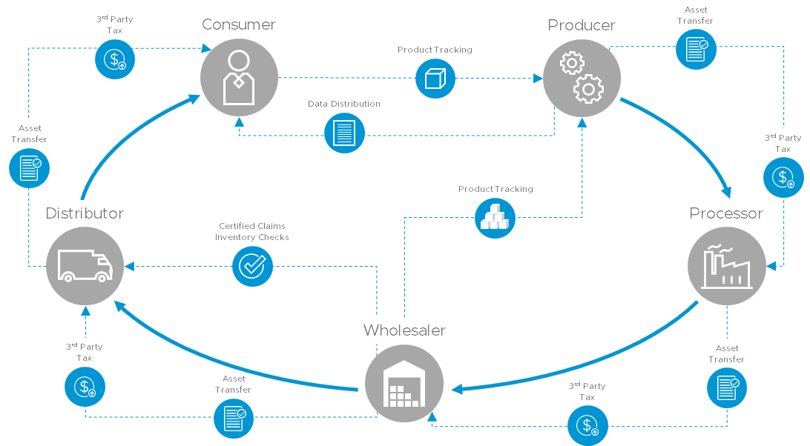

# Supply Chain Decentralized Application

Blockchain is a platform that contains blocks of data about transactions between parties. The data structure within blockchain links these blocks of data to create a ledger of all the transactions. The data is cryptographically authenticated to prevent alteration and spread of any corrupt entry. Blockchain has several participant nodes that have full or partial copies of the blockchain. The participant nodes act as validators and consumers of the blockchain. A consensus algorithm allows all the participating nodes in the blockchain to agree on what data needs to be added to the ledger and verified as accurate.



One use case of blockchain is to track different types of transactions in a supply chain in a secure and transparent manner. Starting from the manufacturer to the sale of the product every transaction in the supply chain is documented to reduce costs and minimize human error. The supply chain decentralized application (dApp) uses smart contracts, which are self-executing contractual promises, stored on the blockchain that no one controls, and everyone can trust. The supply chain dApp can be used on VMware Blockchain or other Ethereum-based blockchain.

## Setup with Docker

Clone the VMware Blockchain sample repository.

git clone https://<url>

Build the Docker container.

```shell
docker-compose build
```

Update the `truffle-config.js` with the correct url, username and password.

```shell
  vmware: {
    network_id: "*",
    provider: () => new Web3.providers.HttpProvider(
      "https://<username>:<password>@<url>"
    )
  },
```

Use the Docker container to run truffle migrate and deploy contracts.

```
docker-compose run supply-chain truffle migrate --reset --network=vmware
```

Open the `docker-compose.yml` file.

Update the environment BC_URL endpoint in the `docker-compose.yml` file to point to your ETH RPC instance.

```shell
    volumes:
      - ./build:/app/build
    environment:
      # Example
      # - BC_URL=http://localhost/blockchains/local/api/concord/eth
      - BC_URL=<change-me>

```

Start the server.

```shell
docker-compose up
```

Open `localhost:4200` in a web browser.

## Configure and Deploy Without Docker

### Prerequisites

- Verify that you have Git, Node 8.9+ and npm installed.
- Verify that you have installed and configured Truffle v4 suite framework for smart contracts in your environment. See the Truffle [suite installation](https://truffleframework.com/docs/truffle/overview).
```
npm install -g truffle@4.1.15
```
- Verify that the Ganache application, an Ethereum network simulator is running properly. See [Ganache installation](https://truffleframework.com/ganache).


### Setup

Install the application dependencies.

```shell
npm install
```

Deploy the contracts on Ganache.

```shell
truffle migrate --reset --network=development 
```

Deploy the contracts on VMware blockchain.

Open `truffle-config.js` and update the username, password, and path under the VMwware network.

```shell
    vmware: {
      network_id: "*",
      provider: () => new Web3.providers.HttpProvider(
        "http://<username>:<password>@vmware.blockchain/blockchains/<change>/api/concord/eth/"
      )
    },
```
Deploy the contracts.

```shell
truffle migrate --reset --network=vmware 
```

Run tests to verify that everything is working correctly.

```shell
# On ganache
npm run truffle:test:ganache

# On vmware blockchain
npm run truffle:test:vmware
```

Interact with the contracts, by using the truffle console.

```shell
truffle console
```

In the console, run the following commands.

```shell

# Get the deployed contract
let contract;
Orders.deployed().then(function(c){ contract = c});

# Create an order
contract.create(web3.fromAscii("Apples"), 100);

# Get the order address you just created
contract.orders.call(0)
'0xf0de5c223985434b12b8c858ccfa9b9a309a0251'

# Initialize the order into our ABI
# Application Binary Interface (ABI) is a list of the contract's functions and arguments in the JSON format. To use a smart contract's function the ABI is used to hash the function definition so it can create the EVM bytecode required to call the function.
let order = Order.at('0xf0de5c223985434b12b8c858ccfa9b9a309a0251');

# Assign owners
order.setOwners.sendTransaction('0xfa1a4c33aa682d34eda15bf772f672edddac13aa', '0xfa1a4c33aa682d34eda15bf772f672edddac13aa', '0xfa1a4c33aa682d34eda15bf772f672edddac13aa', '0xfa1a4c33aa682d34eda15bf772f672edddac13aa', '0xfa1a4c33aa682d34eda15bf772f672edddac13aa');
'0x221030d0af4734a7e8c8dade5cdd945e9940efa35725daaee3315ff908dd108b'

# Approve the order
order.approve.sendTransaction();
'0xdef210546df026c422f7e1c01785abbf147ec2ae95a7d2a96bf8b8e6edfa345e'

# Get metadata
order.meta.call();
[ '0x4170706c65730000000000000000000000000000000000000000000000000000',
  BigNumber { s: 1, e: 2, c: [ 100 ] },
  false ]

# Make the metadata more readable
 web3.toAscii('0x4170706c65730000000000000000000000000000000000000000000000000000');
'Apples\u0000\u0000\u0000\u0000\u0000\u0000\u0000\u0000\u0000\u0000\u0000\u0000\u0000\u0000\u0000\u0000\u0000\u0000\u0000\u0000\u0000\u0000\u0000\u0000\u0000\u0000'

# Additional metadata improvements
web3.toUtf8('0x4170706c65730000000000000000000000000000000000000000000000000000');
'Apples'

```

## Startup the Development Server


Ganache
```
npm run start:ganache
```

VMware Blockchain

Update the `proxy.conf.json` file with the correct target path to your vmware blockchain instance.

```
npm run start:vmware
```

### Code Scaffolding

Run `ng generate component component-name` to generate a new component. You can also use `ng generate directive|pipe|service|class|guard|interface|enum|module`.

### Running Unit Tests

Run `npm run test` to execute the unit tests via [Karma](https://karma-runner.github.io).

### Style Guide and Overall Structure

Use the angular cli generate commands and this [styleguide](https://angular.io/guide/styleguide#overall-structural-guidelines) for style guidance.

### Further help

To get more help on the Angular CLI use `ng help` or go check out the [Angular CLI README](https://github.com/angular/angular-cli/blob/master/README.md).

