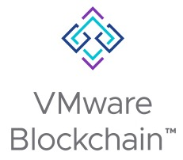

# Getting Started
- VMware Blockchain for Ethereum Beta
  - [Github Link](https://github.com/vmware-samples/vmware-blockchain-samples/tree/stage-dev-kit/vmbc-ethereum)
  - [Github Docs Website Link](https://vmware-samples.github.io/vmware-blockchain-samples/)

## Maintainers

- [@ramkri123](https://github.com/ramkri123)
- [@dparmar](https://github.com/dparmar)
- [@saiakhil2012](https://github.com/saiakhil2012)

## Contributors

- [@MRHarrison](https://github.com/MRHarrison)
- [@pengluhyd](https://github.com/pengluhyd)
- [@rkischuk](https://github.com/rkischuk)
- [@robem](https://github.com/robem)
- [@teoparvanov](https://github.com/teoparvanov)
- [@tompscanlan](https://github.com/tompscanlan)
- [@sedhuait](https://github.com/sedhuait)
- [@NickSneo](https://github.com/NickSneo)
- [@saanvijay](https://github.com/saanvijay)
- [@saiakhil2012](https://github.com/saiakhil2012)
- [@dinkar2](https://github.com/dinkar2)
- [@sanchitaroy](https://github.com/sanchitaroy)
- [@amittullo](https://github.com/amittullo)
- [@rtellamsetty](https://github.com/rtellamsetty)
- [@eswarscode](https://github.com/eswarscode)
- [@Tensaiyez](https://github.com/Tensaiyez)
- [@kevinx1vmw](https://github.com/kevinx1vmw)

## License

[MIT](https://choosealicense.com/licenses/mit/)

