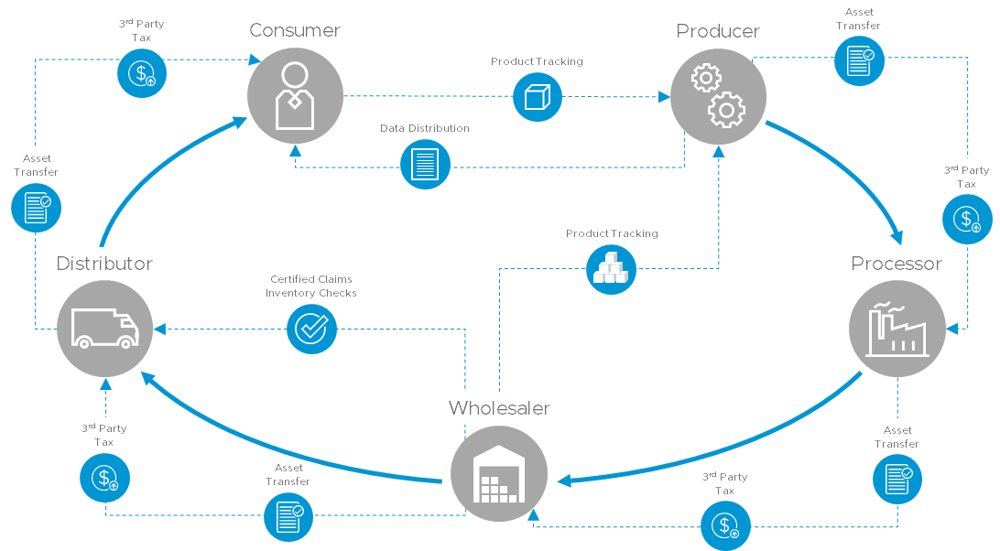
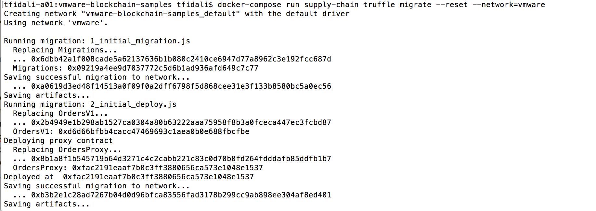
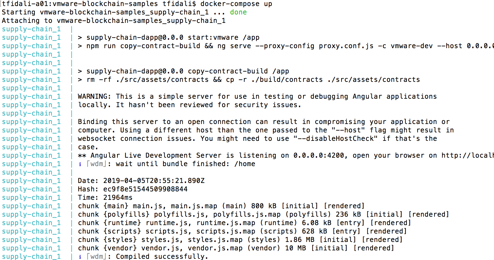

# Supply Chain Decentralized Application [](https://travis-ci.org/vmware-samples/vmware-blockchain-samples)

Blockchain is a platform that contains blocks of data about transactions between parties. The data structure within blockchain links these blocks of data to create a ledger of all the transactions. The data is cryptographically authenticated to prevent alteration and spread of any corrupt entry. <BLOCKQUOTE></BLOCKQUOTE>Blockchain has several participant nodes that have full or partial copies of the blockchain. The participant nodes act as validators and consumers of the blockchain. A consensus algorithm allows all the participating nodes in the blockchain to agree on what data needs to be added to the ledger and verified as accurate.



One use case of blockchain is to track different types of transactions in a supply chain in a secure and transparent manner. Starting from the manufacturer to the sale of the product every transaction in the supply chain is documented to reduce costs and minimize human error. The supply chain decentralized application (dApp) uses smart contracts, which are self-executing contractual promises, stored on the blockchain that no one controls, and everyone can trust. The supply chain dApp can be used on VMware Blockchain or other Ethereum-based blockchain.

## Quick Setup with Docker

### Prerequisites

Install docker [here](https://docs.docker.com/install/)
In the case of VMware Blockchain:
* Note the ID of the blockchain, referred to as <blockchain-id> throughout the documentation
* Generate an API token in the CSP console, referred to as <api-token> throughout the documentation

### Setup

First lets clone the repo and build the container.

```shell
git clone git@github.com:vmware-samples/vmware-blockchain-samples.git

cd vmware-blockchain-samples

```

Update the `truffle-config.js` with the correct url with the basic auth username and password.

```shell
  vmware: {
    network_id: "*",
    provider: () => new Web3.providers.HttpProvider(
      "https://<username>:<api-token>@<hostname>/api/blockchains/<blockchain-id>/concord/eth"
    )
  },
```

docker-compose build

Deploy contracts by running truffle migrate by using our container.

```
docker-compose run supply-chain truffle migrate --network=vmware  
```


Update the environment BC_URL endpoint in the `docker-compose.yml` file to point at your ETH RPC instance.

```shell
    volumes:
      - ./contracts:/app/contracts
      - ./migrations:/app/migrations
      - ./build:/app/build
      - ./truffle-config.js:/app/truffle-config.js
    environment:
      # Example for VMware Blockchain
      # - BC_URL=http://localhost.vmware.com/api/blockchains/<blockchain-id>
      - BC_URL=<change-me>

```

Due to authentication happening in the browser and we don't have a backend fetching access tokens for us, we need to add `supply-chain.vmware.com` to our `/etc/hosts` to get past a browser CORS issue.

So in `/etc/hosts` add:

```
127.0.0.1 supply-chain.vmware.com
```

Then start the server.

```shell
docker-compose up
```


Finally, open [supply-chain.vmware.com:4200](http://supply-chain.vmare.com:4200) in your browser.

NOTE: You may need to open an ssh tunnel if you are running on a separate VM

```ssh
ssh -g -L 4200:localhost:4200 -f -N <VM_IP>
```

## Configure and Deploy Without Docker

### Prerequisites

- Verify that you have Git, Node 8.9+ and npm installed.
- Verify that you have installed and configured Truffle v4 suite framework for smart contracts in your environment. See the Truffle [suite installation](https://truffleframework.com/docs/truffle/overview).
```
npm install -g truffle@4.1.15
```
- Verify that the Ganache application, an Ethereum network simulator is running properly. See [Ganache installation](https://truffleframework.com/ganache).


### Setup

Install application dependencies

```shell
npm install
```

Deploy contracts on ganache

```shell
truffle migrate --reset --network=development 
```

Deploy contracts on VMware Blockchain

First go to `truffle-config.js` and update the username, password and path under the vmwware network:

```shell
    vmware: {
      network_id: "*",
      provider: () => new Web3.providers.HttpProvider(
        "http://<username>:<password>@vmware.blockchain/blockchains/change/api/concord/eth/"
      )
    },
```
Then deploy the contracts

```shell
truffle migrate --reset --network=vmware 
```

Run tests to verify everything is working correctly

```shell
# On ganache
npm run truffle:test:ganache

# On vmware blockchain
npm run truffle:test:vmware
```

Now lets interact with the contracts, by using the truffle console.

```shell
truffle console
```

In the console
```shell

# Get the deployed contract
let contract;
Orders.deployed().then(function(c){ contract = c});

# Create an order
contract.create(web3.fromAscii("Apples"), 100);

# Get the order address you just created
contract.orders.call(0)
'0xf0de5c223985434b12b8c858ccfa9b9a309a0251'

# Initialize the order into our ABI
# Application Binary Interface (ABI) is a list of the contract's functions and arguments in the JSON format. To use a smart contract's function the ABI is used to hash the function definition so it can create the EVM bytecode required to call the function.
let order = Order.at('0xf0de5c223985434b12b8c858ccfa9b9a309a0251');

# Assign owners
order.setOwners.sendTransaction('0xfa1a4c33aa682d34eda15bf772f672edddac13aa', '0xfa1a4c33aa682d34eda15bf772f672edddac13aa', '0xfa1a4c33aa682d34eda15bf772f672edddac13aa', '0xfa1a4c33aa682d34eda15bf772f672edddac13aa', '0xfa1a4c33aa682d34eda15bf772f672edddac13aa');
'0x221030d0af4734a7e8c8dade5cdd945e9940efa35725daaee3315ff908dd108b'

# Approve the order
order.approve.sendTransaction();
'0xdef210546df026c422f7e1c01785abbf147ec2ae95a7d2a96bf8b8e6edfa345e'

# Get metadata
order.meta.call();
[ '0x4170706c65730000000000000000000000000000000000000000000000000000',
  BigNumber { s: 1, e: 2, c: [ 100 ] },
  false ]

# Make the metadata more readable
 web3.toAscii('0x4170706c65730000000000000000000000000000000000000000000000000000');
'Apples\u0000\u0000\u0000\u0000\u0000\u0000\u0000\u0000\u0000\u0000\u0000\u0000\u0000\u0000\u0000\u0000\u0000\u0000\u0000\u0000\u0000\u0000\u0000\u0000\u0000\u0000'

# Additional metadata improvements
web3.toUtf8('0x4170706c65730000000000000000000000000000000000000000000000000000');
'Apples'

```

## Create and Configure an Order Contract
### Steps
- Login to the Supply Chain UI.
- Click New Order.
- Select an item from the drop-down menu and assign a value to the item.
- In the top left corner, set the user role to Farmer.
- Click Approve.
- In the top left corner, set the user role to Auditor.
- Click Organic.
- Click Upload and navigate to vmware-blockchain-samples > build > contracts.
- Upload a JSON contract file less than 200KB.
- In the top left corner, set the user role to Storage.    
- Click Received and Finished.
- In the top left corner, set the user role to Distributor.
- Click In Transit.
- In the top left corner, set the user role to Super Market.
- Click Received.

## Running Supply Chain Docker Image On Local Docker Network

Update `docker-compose.yml` file to use helen path:
```
- BC_URL=http://helen:8080
```

Then use the local network yaml file to connect.
```
docker-compose -f docker-compose.yml -f docker-compose-local-network.yml up -d
```

## Startup Dev Server

Ganache
```
npm run start:ganache
```

VMware Blockchain

Update the `proxy.conf.json` file with the correct target path to your vmware blockchain instance.

```
npm run start:vmware
```

### Code scaffolding

Run `ng generate component component-name` to generate a new component. You can also use `ng generate directive|pipe|service|class|guard|interface|enum|module`.

### Running unit tests

Run `npm run test` to execute the unit tests via [Karma](https://karma-runner.github.io).

### Style Guide and Overall Structure

Use the angular cli generate commands and this [styleguide](https://angular.io/guide/styleguide#overall-structural-guidelines) for style guidance.

### Further help

To get more help on the Angular CLI use `ng help` or go check out the [Angular CLI README](https://github.com/angular/angular-cli/blob/master/README.md).

