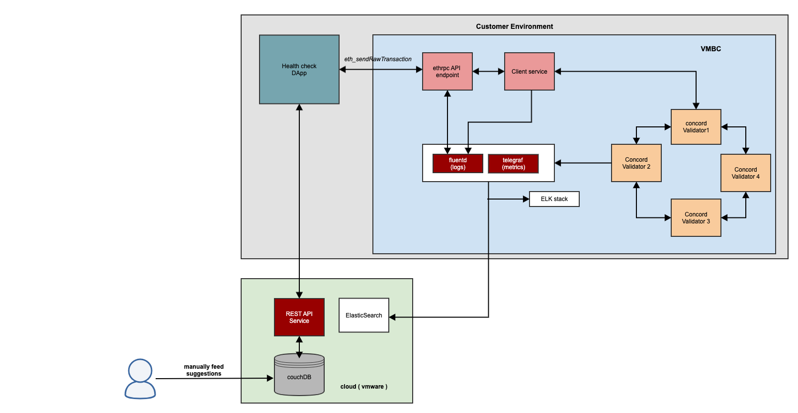

# Introduction
Healthcheck and metrics feature is to capture the Logs and Metrics required to assess the health of the Ethereum Developer Kit. This will enable us to monitor the health of developer kit and provide suggestions to the customers, on how they can fix issues if any with the developer kit.

# Architecture
## Kubernetes deployment overview


Health check and API metrics both should be checked periodically and parallelly. Health check involves periodically sending transactions to a health check smart contract using a health check DApp. API metrics ensures that the VMBC blockchain works well and also what are all the Ethereum API's consumed by the end user.

For the healthcheck logs, the dApp will periodically sends the write transaction to VMBC, the dApp will get response as either failure message or event log as success response. If the transaction succeeded, the event log along with user details and timestamp will be sent to Vmware cloud via API server. If the transaction failed, the dApp will get the failure message and will be sent to Vmware cloud via API server. Vmware cloud will store the success/failure messages in DB. In case of failure message, the Vmware team will look the failure log and timestamp in DB, get the user details, blockchain id details and concord logs from the ElasticSearch and search for the suggested solution in DB. Since we already got the user details the suggestion will be sent to user via email. The metrics detail will be useful for user analytics like what are all the API's are used by customer. 

In the logs, we can differentiate between healthcheck contract logs and actual business logic contract logs by searching the health contract address in the log. Moreover, we can find which user and which blockchain id is used in the API call. The deployment of vmware cloud components should be done before we release the product so that we can share URL with customers. Customer has to sign the end user agreement to send their logs to vmware cloud. 
# Healthcheck and VMBC communication modes
The communication between healthcheck dapp and Vmware Ethereum Blockchain happens via http and https modes. The following table describes the supported and unsupported combination. Any other combinations which are not listed in the below table are not supported as well. 
| Mode | VMBC | Healthcheck dApp | isSupported |
|-----------|-------------|-------------|-------------|
|  http | http | http | yes |
|  https | mTLS | mTLS | yes |
|  https | mTLS+JWT | mTLS+JWT | no |
|  https | serverTLS+JWT | serverTLS+JWT | no |

## How to enable healthcheck dApp with mTLS
If the VMBC is mTLS enabled then you should configure the healthcheck dApp also mTLS enabled. If not, the healthcheck dApp can't send transactions to VMBC. 
The heathcheck dApp requires client.crt, client.key and ethrpc-ca.crt(filenames should not be changed), these files to be copied to ./certs directory and then you can do `helm install` of healthcheck dApp.

# Helm installation
``` sh helm install healthcheckdapp . --set healthcheck.dapp.imageCredentials.registry="" --set healthcheck.dapp.imageCredentials.username="" --set healthcheck.dapp.imageCredentials.password=""  --set healthcheck.apiserver.vmwareCloudApiServerUrl="" --set healthcheck.vmbc.blockchainUrl="" ```

# Helm installation for mTLS
``` sh helm install healthcheckdapp . --set healthcheck.dapp.security.type="mtls" --set healthcheck.dapp.imageCredentials.registry="" --set healthcheck.dapp.imageCredentials.username="" --set healthcheck.dapp.imageCredentials.password=""  --set healthcheck.apiserver.vmwareCloudApiServerUrl="" --set healthcheck.vmbc.blockchainUrl="" ```

#### Image, Blockchain location settings

| Name                             | Description                                      | Value                       | Type      |
|----------------------------------|--------------------------------------------------|-----------------------------|-----------|
| healthcheck.healthcheckEnable | To enable healthcheck remote logging           | default: "false"                         | Mandatory |
| healthcheck.dapp.healthcheckInterval | Send transactions for every given interval in seconds. Interval range >= 5mins and <= 24 hours         | default: "300" (5 minutes)                         | Optional |
| healthcheck.vmbc.blockchainUrl | URL for ETH-RPC service. Determined from the VMBC deployments exposed service. | `blockchainUrl="http://localhost:8545"`  | Mandatory |
| healthcheck.dapp.imageCredentials.registry | Container registry for image downloads           | ""                          | Mandatory |
| healthcheck.dapp.imageCredentials.username | Username to access/download for registry         | ""                          | Mandatory |
| healthcheck.dapp.imageCredentials.password | Password to access/download for registry         | ""                          | Mandatory | 
| healthcheck.apiserver.vmwareCloudApiServerUrl | Vmware cloud API server URL         | ""                          | Mandatory |
