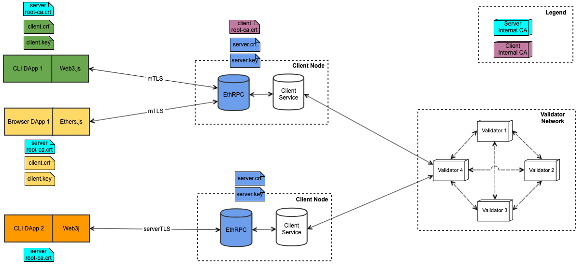
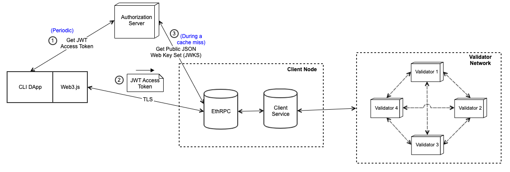
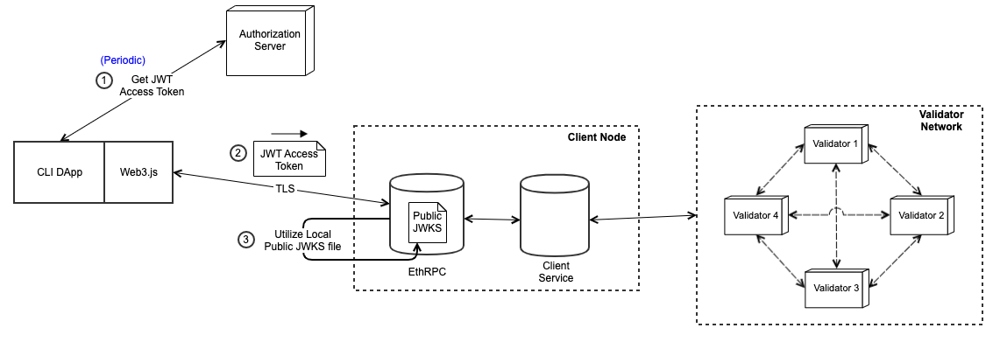

# Ethereum Permissioning

VMware Blockchain for Ethereum in a broad form provides two forms of permissioning, Read and Write Permissioning. Read Permissioning is provided using Certificate Authorities in the form of Mutual TLS by utilizing Client certificates or using OAuth Server by utilizing Client JWTs. The Write Permissioning is provided using a permissioning pre-deployed smart contract in accordance with the Enterprise Ethereum Alliance (EEA) specifications.

## Authentication and Read Permissioning
Read Permissioning is implemented through external Authorizations mechanisms such as Certificate Authority or OAuth Server in two forms namely Mutual TLS and Token Authentication.

**Terminology**
- dApp: Decentralized Application
- TLS: Transport Layer Security
- mTLS: Mutual TLS
- CA: Certificate Authority
   - Internal CA: When Root CA Certificate is not well-known
   - External CA: When Root CA Certificate is well-known
- JWT: JSON Web Token
- JWK: JSON Web Key
- JWKS: JSON Web Key Set
- CLI: Command Line Interface

<!--### High Level Feature Architecture-->
### Server and Mutual TLS using Certificate Authority
There will be two options for TLS Modes namely ServerTLS and MutualTLS which can be enabled at EthRPC level

Following diagram depicts both mTLS and serverTLS which have been enabled in two different Client Nodes



**Description of the Depiction**
- Each dApp and EthRPC Server instance have certificates depicted along side. These are the certificates and keys required for the respective components
- Colors represent the association of Certificates and Keys with corresponding dApp or EthRPC instance or internal CA
- When using multiple clients, on the basis of the need, different clients can correspond to the same or different Server or Client related CA and Authentication Server
- Above is just a depiction few of the scenarios which are feasible

**Few Notable Points**
- Server TLS
   - dApp
      - If using an internal CA based Server Certificate, dApp needs to utilize Root Certificate of the EthRPC Server's CA Certificate
   - EthRPC
      - Needs to start up with a Server certificate. If using a internal CA certificate, the root certificate of the internal CA would need to be provided for dApp clients
- Mutual TLS
   - dApp
      - If using an internal CA based Server Certificate, dApp needs to utilize Root Certificate of the EthRPC Server's CA Certificate
      - dApp needs to use Client certificate and Client Key
   - EthRPC
      - Needs to start up with a Server certificate. If using a internal CA certificate, the root certificate of the internal CA would need to be provided for dApp clients
      - If dApp is using an internal CA for Client Certificate, the root certificate of the internal CA which was used to sign the client certificate is needed by EthRPC

### Token Authentication using Authorization Server
Token Authentication can be utilized for Client Authentication. Any OAuth2.0 standard based Authorization server can be used. We have used Keycloak based Authorization server for development and testing.

Following are few responsibilities of components,
- dApp
   - Fetching of a JWT Access Token from an Authorization Server managed by Customer
   - When utilizing the integration libraries the JWT Access Token has to be passed as a header to EthRPC
- EthRPC
   - When deploying blockchain with token authentication enabled, either URI of the Authentication server or a public JWKS file needs to be provided
      - The recommended approach is to provide URI of the Authorization server
      - Issuer URI mentioned here is the `issuer` field available in the Open ID Provider metadata (https://openid.net/specs/openid-connect-discovery-1_0.html#ProviderMetadata)
      - JWKS JSON content is available at the Authorization Server’s `jwks_uri` which is available in the its Provider metadata (https://openid.net/specs/openid-connect-discovery-1_0.html#ProviderMetadata)


Following are the depictions for two of the ways EthRPC can be configured to verify JWT Token,

#### JWT Token Verification using Live Authorization Server


**Description of the Depiction**
1. The dApp procures JWT Token from the JWT Authorization Server
   - This operation would happen periodically, based on the expiry time set for the JWT Token
2. The dApp through the selected integration library would pass the above acquired JWT Token as a header
3. EthRPC would communicate with the JWT Authorization Server to get the public key for verifying the JWT Token received from dApp. EthRPC would cache the public keys of Authorization server

#### JWT Token Verification using Local Public Key


**Description of the Depiction**
1. The dApp procures JWT Token from the JWT Authorization Server
   - This operation would happen periodically, based on the expiry time set for the JWT Token
2. The dApp through the selected integration library would pass the above acquired JWT Token as a header
3. EthRPC would utilize the local public JWKS file for verifying the JWT Token received from dApp

### User Perspective
This feature offers three distinct capabilities - which can be combined depending on the user goals. These capabilities are:

1. Security for Server authentication - Provides assurances to the application that the end-point is indeed that of VMBC, and that the public key is indeed that of the VMBC EthRPC server.
2. Security for Data in Transit - Mechanism to secure communication between the application and the EthRPC server via encrypting data in flight.
3. Read permissioning - Mechanism for the blockchain administrators to decide who has read access to the blockchain, via issuing certificates or JWT Tokens to applications/users.

### Enabling Read Permissioning in Blockchain
The Read Permissioning in Blockchain is exposed as mutual TLS and JWT Token based authentication through Certificate Authorities and Authorization servers. The valid combinations which which a client can be brought up are no TLS, mutual TLS, Client JWT with server TLS or Client JWT with mutual TLS.

We have two ways to consume this feature,
1. Utilize the pre-generated helm charts related to various combinations mentioned above [here](../vmbc-deployment/vmbc-sample-deployments)
2. Generate new helm charts for use-cases where you need more customization than the sample helm charts mentioned above

#### Details about relevant fields in Helm charts
Under `clientTlsAndTokenAuthSettings` for each VMBC Client, following fields could exist depending on the configuration of the helm charts you are using,
- `type`
   - Supported types are `mutualTLS` and `serverTLS`
- `serverCert`
   - Server certificate which will be used by EthRPC
      - X509 format based certificate
   - Mandatory field if `clientTlsAndTokenAuthSettings` is present
- `serverPrivateKeySecret`
   - Name of the secret containing the private key corresponding to the server certificate
   - Mandatory field if `clientTlsAndTokenAuthSettings` is present
   - A sample secret file is [here](../vmbc-deployment/vmbc-sample-deployments/authentication-and-authorization/secret.yaml)
      - The value in secret is base64 encoded
      - You can use `kubectl` to create this secret in your kubernetes environment
- `clientRootCaCert`
   - Root CA certificate for the client certificates which will be used by dApps
      - X509 format based certificate
   - Mandatory field if using `mutualTLS`
- `tokenAuthentication`
   - `issuerUri`
      - Contains the URI of the Authorization server
      - If tokenAuthentication is to be used, either the current field or `publicJwks` field is mandatory
   - `issuerCaCert`
      - CA Certificate for the `issuerUri`
         - X509 format based certificate
         - This field is optional and necessary when using a https based authentication server whose CA is not well-known
   - `publicJwks`
      - A JSON Web Key Set (JWKS) representing the public keys of Authorization server
      - If tokenAuthentication is to be used, either the current field or `issuerUri` field is mandatory

#### Sample Pre-Generated Helm Charts
We have pre-generated few set of helm charts for different feature set combinations of authentication mechanism enabled. The samples have been generated for minikube environment with server certificate of client-ethrpc with static ip as `192.168.200.200`. The token auth for the sample charts is based on live authorization server and the default certificate for the authentication server is a self-signed certificate for `localhost`. The secret corresponding to the `serverPrivateKeySecret` for all the pre-generated sample helm charts is present [here](../vmbc-deployment/vmbc-sample-deployments/authentication-and-authorization/secret.yaml).

```sh
# Sample command to create secret resource inside kubernetes cluster
kubectl apply -f secret.yaml

# Command to install helm charts
# Utilize the corresponding readme files inside the helm charts to set appropriate values and install helm charts
```

**Few Notable Points**
- Minikube can be started with static ip to utilize the samples mentioned below easily (Reference: https://minikube.sigs.k8s.io/docs/tutorials/static_ip/)
   - Minimum version of minikube required for using static-ip feature is `1.29.0`
- Only values for standalone fields which are already in use are the only fields recommended and supported to be modified.
   - For example, if `issuerUri` is already being used, only then the value for that field can be changed in `values.yaml` of the helm charts.
   - For all other scenarios where a field was not in use or empty before and needs to be changed, you need to generate a new set of helm charts using the procedure mentioned [here](#generating-new-helm-charts).

**Sample Helm Charts**
- [VMBC Four Node and One Client Deployment](../vmbc-deployment/vmbc-sample-deployments/authentication-and-authorization/vmbc-four-node-one-client-deployment/)
   - [mutual TLS](../vmbc-deployment/vmbc-sample-deployments/authentication-and-authorization/vmbc-four-node-one-client-deployment/mutual-tls/)
   - [Client JWT with server TLS](../vmbc-deployment/vmbc-sample-deployments/authentication-and-authorization/vmbc-four-node-one-client-deployment/server-tls-with-token-auth/)
   - [Client JWT with mutual TLS](../vmbc-deployment/vmbc-sample-deployments/authentication-and-authorization/vmbc-four-node-one-client-deployment/mutual-tls-with-token-auth/)

#### Generating new Helm Charts
We have [vmbc-orchestrator-tool](../vmbc-deployment/vmbc-k8s-orchestrator-tool/) which can be used to generate new helm charts when there is a need for introducing new fields or removing fields or changing values for any fields which have not been used in the sample helm charts.

The relevant fields for the current feature in discussion is same as mentioned in the [above section](#details-about-relevant-fields-in-helm-charts). Only difference is the parent field under which all the fields mentioned above become relevant is `tlsAndTokenAuthSettings` inside a `client` construct in `deployment.json`

A sample `deployment.json` with different options and fields is [here](../vmbc-deployment/vmbc-k8s-orchestrator-tool/ethereum-authentication-and-authorization/readme.md).

#### Serviceability
If there is an update required for an existing standalone field such as a certificate or URI or public JWKS content, you can use update the fields in `values.yml` and can run following command to update,

```sh
helm upgrade <release name> <chart dir>
```

### Using Sample DApps for Read Permissioning
As part of this feature, we have provided multiple sample dApps using various integration libraries such as Web3.js, Web3j and Ethers.js as reference and sample implementation to utilize various aspects of read permissioning in VMBC.

- Few Notable Points
   - All the following sample dApps which have a config file are pre-populated with mutualTLS with token authentication mode
   - All the sample artifacts which can be used with the sample dApps are present [here](../../vmbc-ethereum/vmbc-deployment/vmbc-sample-deployments/authentication-and-authorization/artifacts-for-dapps/)
      - The `ethrpc-root.ca` corresponds to the server certificate (generated as a IP based certificate for static IP `192.168.200.200`) added in the sample helm charts described in the above section
      - The `client.crt` and `client.key` are created with `clientRootCa` cert mentioned in the sample helm charts
      - The `auth-server.crt` corresponds to a localhost based auth server
      - The config and following sample dApps are for reference purpose, depending on the integration library and language of the dApp might have variations in their functionality and support
      - As these sample dApps are only for reference, we have not done any input validations, it is up to the user to ensure the validity and correctness of blockchain and config files

#### Web3.js Sample dApp
- Set the content inside [config file](./sample-dapps/authentication/web3js-dapp/config.json) as per blockchain and related environment,
- Few of the notable parameters,
   - `tls.mode` supported are `serverTLS` or `mutualTLS`
   - `clientJwt.enabled` should be `true` if VMBC has tokenAuthentication enabled

**Pre-Requisites**
- Blockchain with the current feature enabled with appropriate components running and reachable from the dApp
- Node.js v16.19.1 (this is the max version supported)
- npm

**Steps to run the sample dApp**
```sh
# Change to lib for authentication sample dapps
cd vmware-blockchain-samples/vmbc-ethereum/permissioning/sample-dapps/authentication/lib
# Install dependencies
npm install

# Change to web3js authentication sample dapp
cd vmware-blockchain-samples/vmbc-ethereum/permissioning/sample-dapps/authentication/web3js-dapp
# Install dependencies
npm install

# Edit the config file as per your enviroment
# Path to config file: vmware-blockchain-samples/vmbc-ethereum/permissioning/sample-dapps/authentication/web3js-dapp/config.json

# If using an internal CA based Auth Server export NODE_EXTRA_CA_CERTS to ca certificate of Auth Server otherwise ignore the variable
export NODE_EXTRA_CA_CERTS=../../../../vmbc-deployment/vmbc-sample-deployments/authentication-and-authorization/artifacts-for-dapps/auth-server.crt

# Run the sample dApp
node sample-dapp.js
```

#### Web3j Sample dApp
 Set the content inside [config file](./sample-dapps/authentication/web3j-dapp/config.json) as per blockchain and related environment,
- Few of the notable parameters,
   - `tls.mode` supported are `serverTLS` or `mutualTLS`
   - `clientJwt.enabled` should be `true` if VMBC has tokenAuthentication enabled

**Pre-Requisites**
- Blockchain with the current feature enabled with appropriate components running and reachable from the dApp
- Maven
- Java

**Steps to run the sample dApp**
```sh
# Change to web3j authentication sample dapp
cd vmware-blockchain-samples/vmbc-ethereum/permissioning/sample-dapps/authentication/web3js

# Installation
mvn clean install

# Edit the config file as per your enviroment
# Path to config file: vmware-blockchain-samples/vmbc-ethereum/permissioning/sample-dapps/authentication/web3j-dapp/config.json

# Running of the https version
mvn exec:java -Dexec.mainClass=com.vmware.SampleDappHttps

# Running of the wss version
## This just establishes a subscription
mvn exec:java -Dexec.mainClass=com.vmware.SampleDappWss
```

#### Ethers.js Sample dApp
 Set the content inside [config file](./sample-dapps/authentication/web3j-dapp/config.json) as per blockchain and related environment,
- Few of the notable parameters,
   - `tls.mode` supported is only `serverTLS`
   - `clientJwt.enabled` should be `true`

**Pre-Requisites**
- Blockchain with the current feature enabled with appropriate components running and reachable from the dApp
- Node.js v16.19.1 (this is the max version supported)
- npm

**Steps to run the sample dApp**
```sh
# Change to lib for authentication sample dapps
cd vmware-blockchain-samples/vmbc-ethereum/permissioning/sample-dapps/authentication/lib
# Install dependencies
npm install

# Change to ethersjs authentication sample dapp
cd vmware-blockchain-samples/vmbc-ethereum/permissioning/sample-dapps/authentication/ethersjs
# Install dependencies
npm install

# Edit the config file as per your enviroment
# Path to config file: vmware-blockchain-samples/vmbc-ethereum/permissioning/sample-dapps/authentication/ethersjs-dapp/config.json

# If using an internal CA based Auth Server, create a bundle of the auth certificate and the ethrpc-ca.crt as follows
cat ../../../../vmbc-deployment/vmbc-sample-deployments/authentication-and-authorization/artifacts-for-dapps/auth-server.crt ../../../../vmbc-deployment/vmbc-sample-deployments/authentication-and-authorization/artifacts-for-dapps/ethrpc-ca.crt > ca-bundle.crt

# Add the above created bundle to NODE_EXTRA_CA_CERTS
export NODE_EXTRA_CA_CERTS=./ca-bundle.crt

# Run the sample dApp
node sample-dapp.js
```

#### Browser dApps
For browser dApps we currently only support the aspect of mTLS only mode for blockchain client. Detailed procedure of how to set your browser for communicating with VMBC for Ethereum with mTLS only mode is [here](./sample-dapps/authentication/browser-dapps-runbook/README.md).

- Note: If you need to deploy smart contracts using hardhat, then we suggest atleast a two client configuration, where one of the client is ServerTLS with Token Auth and using httpHeaders section of hardhat config, the access token can be passed to deploy contracts and another client with just mTLS to utilize the browser dApp with browser wallet such as Metamask
   - Details about how to pass custom httpHeaders in hardhat config file: https://hardhat.org/hardhat-network/docs/guides/forking-other-networks#custom-http-headers

## Write Permissioning

For Write Permissioning, VMware Blockchain for Ethereum implements “account permissioning” as a tech preview feature in accordance with the Enterprise Ethereum Alliance (EEA) specifications to provide the necessary tools and granularity to govern actions permitted by accounts on the blockchain. Permissioning in the context of enterprise blockchains is a required feature for our customers as they seek ways to control access to deploy and execute smart contracts running on the blockchain. The account permissioning feature can be enabled during network creation by providing the necessary parameters in the deployment configurations file. The compiled permissioning smart contract and the account(s) that can grant permissions to other addresses should also be included in the genesis file. The “permission admin” user can use a dApp or the permissioning user interface to control which accounts are allowed to send transactions and specify the type of transactions permitted. Types of transaction can be WRITE and DEPLOY permissions to other accounts. The dApp should be the preferred method to grant access to a large number of accounts.

By default in VMware Blockchain the permissioning feature is disabled. It means anybody can read and write to blockchain.

### Permissioning Contract
For reference, Permissioning contract is present at `vmware-blockchain-samples/vmbc-ethereum/permissioning/contracts/Permissioning.sol`

(Note: This contract is provided here just for reference, this contract is pre-deployed in VMware Blockchain for Ethereum, changes to this contract's source code here, will not propagate to VMware Blockchain)
 
### Permissioning fields in `values.yaml`

#### Configurable fields
Users can modify the default values in `values.yaml`. All the fields in `genesisBlock` section will be populated as `genesis.json` for VMware Blockchain blockchain.
 * **alloc**: List of admin accounts who can provide the permissions to other users. These admin accounts by default have read, write and deploy permissions. This field can be modified during blockchain deployment.
 * **permissioningContractBin**: The binary of the permissioning smart contract goes here. User can extend the permissioning smart contract without changing the `checkUserAction` and `constructor` functions.

#### Non-configurable fields
 * **permissioningContractAddress**: The permissioning smart contract is pre-deployed during system boot. Note that this field can't be changed.
 
## Write Permissioning

### How to enable write permissioning?

In `values.yaml`, under "permissioning" section change `ethPermissioningWriteEnabled` value to `true` for write permissioning.
The write permissioning is applicable for both "Contract Deployment" and "Write Transactions" to the Blockchain.

### How to test write permissioning?

Follow the steps listed below, Node.js version 14.20 and up is preferred. 
```sh
# Change to write authorization dApp
cd vmware-blockchain-samples/vmbc-ethereum/permissioning/sample-dapps/write-authorization

# Update the .env file with appropriate VMBC_URL Eg: VMBC_URL="http://x.x.x.x:8545"

# Install dependencies
npm install

# Run the dApp
node testWrite.js
```

## Authorization GUI
- This is a Sample GUI dApp which can assist you in providing permissioning to any Ethereum account
- To provide a permission to an account, you need to use Admin Account of VMware Blockchain
- The details about default Admin account in VMware Blockchain is as follows,
 - Admin Account Address: `0xFB389874FB4e03182A7358275eaf78008775c7ed`
 - Admin Account Private Key: `0x5bedcdfdfe7e3d9444b3494eaee4bb9339be4745d7a4f79cd4bde59d3e9e9dcc`
- To use this Admin Account, import this account into Metamask
- Link to more details about Running and Using Authorization GUI is [here](./sample-dapps/authorization-gui/README.md)

## Troubleshooting Guide
### 1. Permission denied Error
```sh
  code: 'SERVER_ERROR',
  body: '{"error":{"code":-32060,"data":"evm error, status code: -2","message":"Permission denied"},"id":58,"jsonrpc":"2.0"}',
```
#### Solution
You have enabled write permissioning. Make sure the ethereum account you are using to send transactions or deploy contract has the WRITE/DEPLOY permission.
### 2. Problem of EthRPC communicating with Authorization server
Following error occurs when there is a problem with issueCaCert supplied to EthRPC and it cannot communicate with Authorization server on startup 
```sh
Caused by: org.springframework.web.client.ResourceAccessException: I/O error on GET request for "https://<host>:8443/realms/master/.well-known/openid-configuration": PKIX path building failed: sun.security.provider.cert
path.SunCertPathBuilderException: unable to find valid certification path to requested target; nested exception is javax.net.ssl.SSLHandshakeException: PKIX path building failed: sun.security.provider.certpath.SunCertPathBuilde
rException: unable to find valid certification path to requested target                                                                                                                                                            
        at org.springframework.web.client.RestTemplate.doExecute(RestTemplate.java:785)                                                                                                                                            
        at org.springframework.web.client.RestTemplate.exchange(RestTemplate.java:670)                                                                                                                                             
        at org.springframework.security.oauth2.jwt.JwtDecoderProviderConfigurationUtils.getConfiguration(JwtDecoderProviderConfigurationUtils.java:150)                                                                            
        ... 55 common frames omitted
```
#### Solution
Ensure that issueCaCert provided for the EthRPC is indeed the one which corresponds to the Authorization server

### 3. Could not connect to node JSON RPC URL
Following error occurs when there is mismatch with the server cert provided to ethRPC and root-ca being used. This can also occur if Node.js version is above the max supported version when using Web3.js
```sh
Error: CONNECTION ERROR: Couldn't connect to node https://<host>:32379.                                                                                                                                                      
    at Object.ConnectionError (/home/dclyde/Code/ethrpc_auth_epic/vmware-blockchain-samples/vmbc-ethereum/permissioning/sample-dapps/authentication/web3js/node_modules/web3-core-helpers/lib/errors.js:66:23)                     
    at Object.InvalidConnection (/home/dclyde/Code/ethrpc_auth_epic/vmware-blockchain-samples/vmbc-ethereum/permissioning/sample-dapps/authentication/web3js/node_modules/web3-core-helpers/lib/errors.js:36:21)                   
    at HttpProvider.failed (/home/dclyde/Code/ethrpc_auth_epic/vmware-blockchain-samples/vmbc-ethereum/permissioning/sample-dapps/authentication/web3js/node_modules/web3-providers-http/lib/index.js:139:25)                      
    at process.processTicksAndRejections (node:internal/process/task_queues:95:5)
```
#### Solution
- Ensure the correct combination of server cert & root-ca and client cert and client root ca cert are being utilized.
- Also ensure the Node.js version is `16.19.1` at max when using with Web3.js

## Known Ecosystem Integration Issues
- The max supported version of NodeJS when using Server or Mutual TLS in EthRPC is `v16.19.1`
- Ethers.js does not support Mutual TLS when using `JsonRpcProvider`, as it does not support passing of client certificate and client key when creating the provider object.
   - For similar reasons, hardhat also does not support the Mutual TLS option
#### Solution
Ensure that the combination of sever cert for EthRPC and root-ca and other combination such as client.cert for the correct clientRootCa provided to EthRPC is being used
## References
- JSON RPC API - https://ethereum.org/en/developers/docs/apis/json-rpc/
- JSON RPC Provider Ethers.js - https://docs.ethers.io/v5/api/providers/jsonrpc-provider/
- Web3 Provider Ethers.js - https://docs.ethers.io/v5/api/providers/other/#Web3Provider
