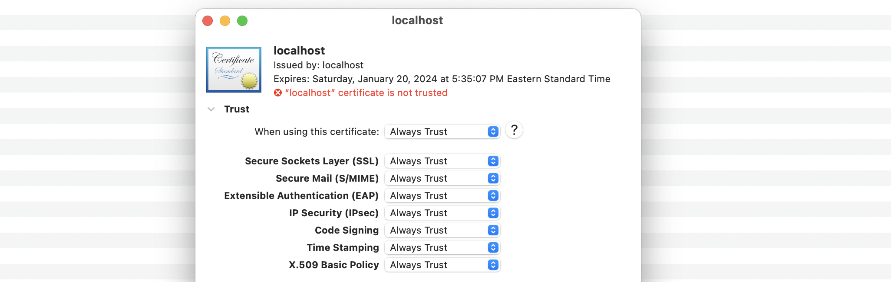
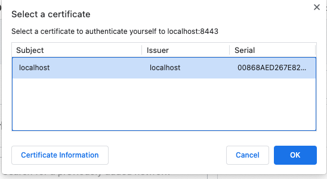
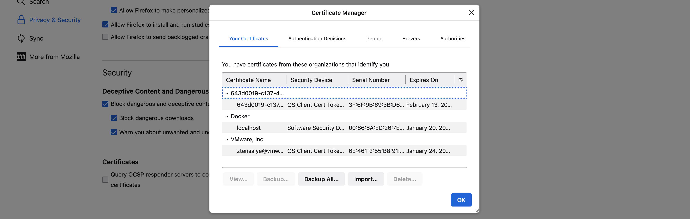

#  Chrome and Firefox Browser for HTTP based mTLS with EthRPC

# Overview

HTTP-based mTLS is a secure protocol that combines HTTPS with mutual authentication of both client and server. This provides an extra layer of security to protect against eavesdropping and tampering of data in transit. Both Chrome and Firefox support HTTP-based mTLS, but the steps to set it up and use it may differ.

## Pre-Requisite

- VMware Blockchain for Ethereum has been deployed
- Suggested and Supported Stack:
  - MAC Operating System
  - Metamask Wallet

## Chrome

Chrome uses OS level certificates to communicate with EthRPC through HTTP based mTLS.

To add root certificate and client certificate, follow these steps:

1. On your computer open the Keychain Access application.
2. Navigate to the "Login" section and select "Certificates".
<br> 

3. Drag and drop the client certificate, client key, and certificate authority into Keychain Access.
4. Double click on the certificates (Client Certificate and Certificate Authority), if you get the following warning "This root certificate isn't trusted" under the trust sub-section set ***When using this certificate*** to ***Always Trust***. Confirm the changes by entering your computer password.
<br> 
5. Open Chrome go to Metamask. Click Expand View then open Settings go to Networks and then click the VMBC URL you are trying to connect to. Chrome will pop up a list of certificates that can be used.
6. Click the certificate you have added and then click okay.
<br> 

7. Change the Metamask network to the VMBC URL, and you should have a successful connection.

### Troubleshooting Guide
- If you face problems related to CORS or some valid scenarios start failing to work during set up, we suggest to reset your chrome browser

## Firefox

Firefox can use OS level certificates and Firefox certificate manager to import client certificates and the certificate authority.
To configure Firefox to use client certificates, we first need to:

1. Type *about:config* in the address bar and press return. A warning page may appear. Click ``` Accept the Risk and Continue``` to go to the *about:config* page.
2. Use the search preference name box at the top of the *about:config* page and search ***network.cors_preflight.allow_client_cert***. Then, set ***network.cors_preflight.allow_client_cert*** to ***True***.
<br> 

3. Then, follow the below steps to import your certificate using Firefox certificate manager or OS level certificates.

### Firefox certificate manager

To add root certificate and client certificate using firefox certificate manager, follow these steps:

1. Navigate to "Settings". Then, "Privacy & Security" scroll down to the "Security" section, then below certificates click ```View Certificates```.

2. Navigate to "Authorities" in the top right. Then import your CA(Certificate Authority) certificate.
3. Then, navigate to "Your Certificates" in the top left and import your client certificate, make sure this is a p12 file format containing client certifcate and client key. 
<br> 
<br> *Note: For more information about p12 file and how to generate a p12 file navigate to the bottom of the page to* [Generating p12 file](#generating-p12-file)

4. Finally, restart Firefox and make sure metamask is connected to the correct VMware Blockchain url.

### Firefox OS level certificate

To add root certificate and client certificate using OS level certificates, follow these steps:

1. On your computer open the Keychain Access application.
2. Navigate to the "Login" section and select "Certificates".
<br> 

3. Drag and drop the client certificate, client key, and certificate authority into Keychain Access.
4. Double click on the certificates (Client Certificate and Certificate Authority), if you get the following warning "This root certificate isn't trusted" under the trust sub-section set ***When using this certificate*** to ***Always Trust***. Confirm the changes by entering your computer password.
<br> 

5. Open Firefox navigate to "Settings". Then "Privacy & Security". Scroll down to the "Security" section, then below certificates click ```View Certificates```. Your client certificates should be seen here under the "Your Certificate" tab and your CA should be seen under the "Authorities" tab.
6. Finally make sure metamask is connected to the correct VMware Blockchain url.


### Generating p12 file

In order to import a client certificate via Firefox certificate manager you need to use a p12 file. To generate a p12 file you need to have a client certificate, client key and the CA certificate. 

<br>The following command allows you to generate a p12 file:

```sh
openssl pkcs12 -export -out client.p12 -inkey <client.key> -in <client.crt> -certfile <ca.crt>
```