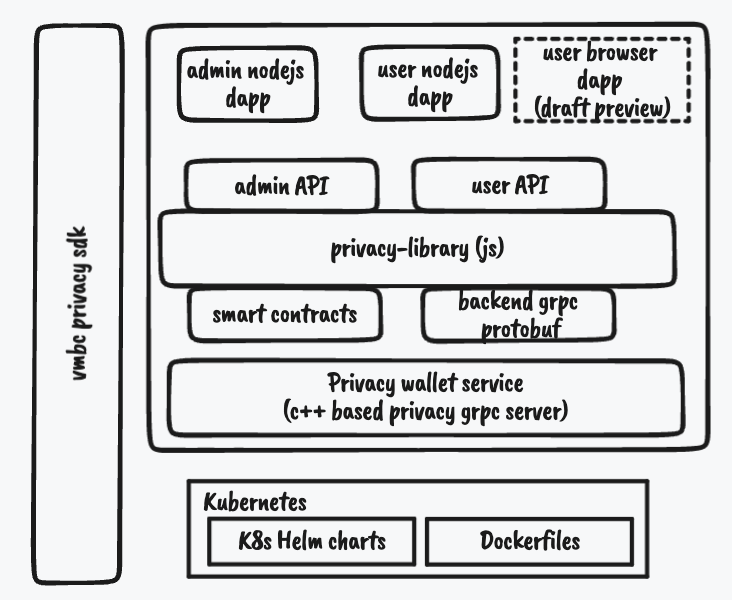

# VMware Privacy SDK
# SDK overview
The Privacy SDK allows JavaScript developers to develop their own privacy applications.

The taxonomy of SDK is shown below:

The primary component at the core of the SDK is [Privacy Library](./privacy-lib). The VMware privacy solution is built on cryptographic technology described in [paper](https://eprint.iacr.org/2022/452.pdf). The Privacy Library abstracts away the cryptographic complexity and provides a simple javascript API for Dapp development.

The SDK currently provides a sample NodeJS based DAPP implementation. Future versions will also provide a fully deployable sample Web Browser based DAPP. Sample source code of web browser DAPP is also provided as reference.

## Node-JS based DAPP

### NODEJS App overview
Sample NodeJS DAPP are build using [privacy wallet library](privacy-lib/privacy-wallet.js). 

| DAPP  | Remark | Location | Docker File | 
| ------------- | ------------- | ------------- |------------- |
| Node Administrator DAPP  | NodeJS based administrator DAPP  | [Admin-Node-DAPP](./admin-dapp/privacy-admin-dapp.js) | [DockerfileAdminDApp](./docker/DockerfileAdminDApp) |
| Node User DAPP  | NodeJS based user DAPP  | [User-Node-DAPP](./user-dapp/privacy-user-dapp.js) | [DockerfileUserDApp](./docker/DockerfileUserDApp) |
| Privacy wallet service | utt wallet | [Privacy wallet service](https://github.com/vmware/concord-bft/tree/master/utt/privacy-wallet-service) | [DockerfilePrivacyService](./docker/DockerfilePrivacyService) |

The companion **privacy wallet service** is essentially the UTT(C++) service that aids with supporting UTT. All the DAPP inturn use this service as backend. The source code of this service is under github open source library. This service can be considered as privacy wallet and holds all sensitive assets including privacy keys and tokens.

[Privacy wallet service](https://github.com/vmware/concord-bft/tree/master/utt/privacy-wallet-service)
This is a GRPC server in essence and the IDL is specified under [wallet-api.proto](https://github.com/vmware/concord-bft/blob/master/utt/privacy-wallet-service/proto/api/v1/wallet-api.proto).

 #### Smart contracts
 SDK includes:
 | Contracts  | Remark | Location | 
 | ------------- | ------------- | ------------- |
 | Privacy Token  | Privacy token transfer based smart contract | [PrivateToken.sol](./privacy-lib/contracts/PrivateToken.sol) | 
 | Public Token  | Public token transfer based smart contract | [PublicToken.sol](./privacy-lib/contracts/PublicToken.sol) | 

These can be used as reference companion.
## Browser based DAPP
SDK will soon support web browser based DAPP sample implementation.
The draft sources are available for reference.

| APP  | Location | Docker File | 
| ------------- | ------------- | ------------- |
| browser user DAPP  | [browser-DAPP](./user-web-dapp/web_client_app.js) | [DockerfileUserWebApp](./docker/DockerfileUserWebApp) |
| browser grpc proxy | [grpc-proxy](./user-web-dapp/envoy.yaml) | [DockerfileEnvoy](./docker/DockerfileEnvoy) |
| Privacy wallet service | [Privacy wallet service](https://github.com/vmware/concord-bft/tree/master/utt/privacy-wallet-service) | [DockerfilePrivacyService](./docker/DockerfilePrivacyService) |

# K8s Helm charts
Privacy application helm charts can be used for kubernetes deployment.

 | Helm charts  | Reference | 
 | ------------- | ------------- |
|[Node-JS APP helm charts](./k8s/helm-charts/Chart.yaml)| [Readme](./k8s/Readme.md) |
| Browser-JS APP helm charts | To be supported soon! |

## Docker files
All the containers are available via artifactory. 
The reference docker files are provided with SDK. 
Users can modify the reference paths based on their container build context to tailor for their environment.