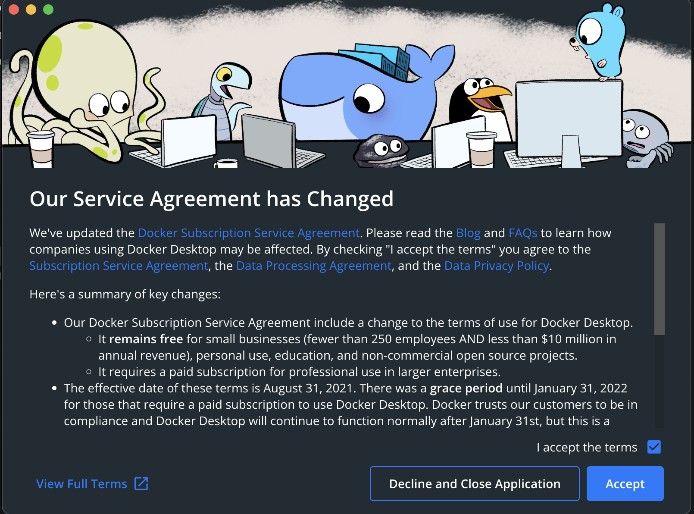
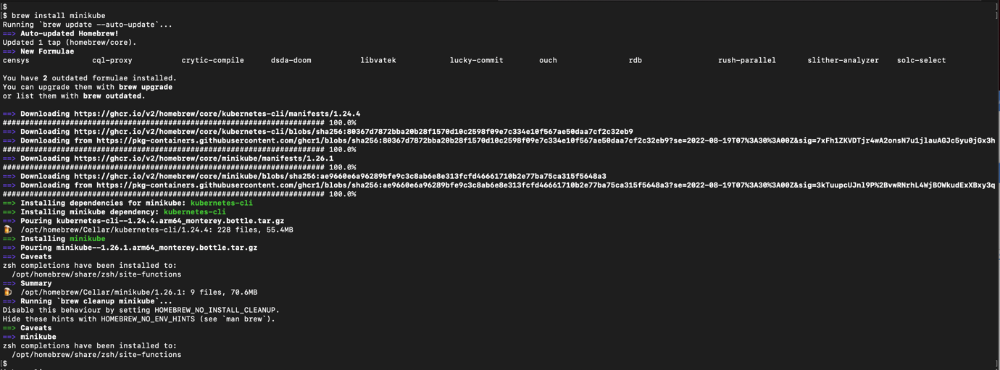
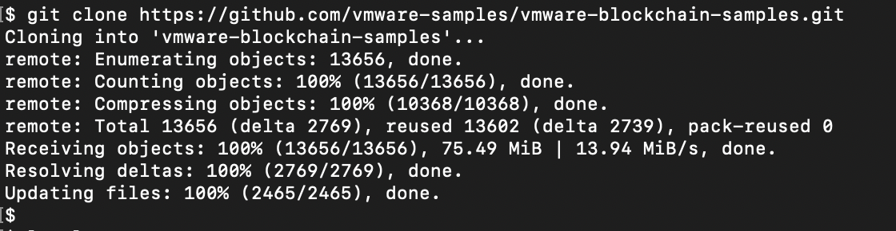
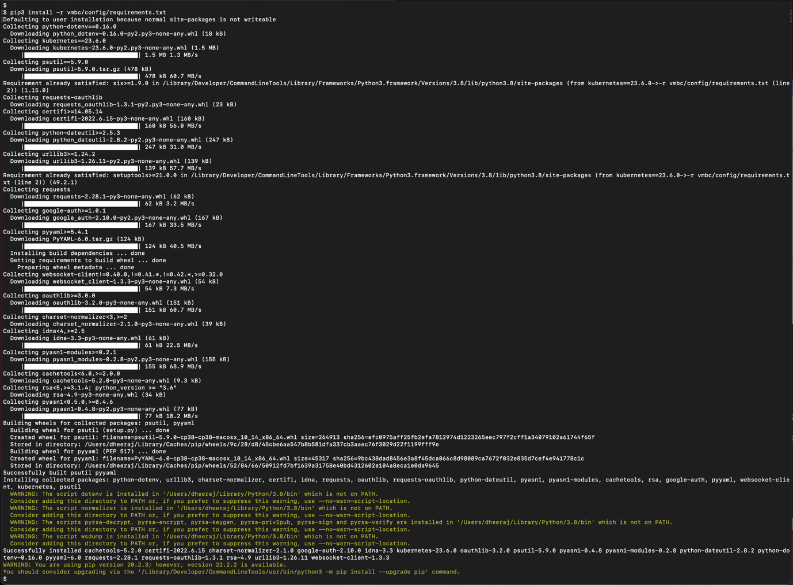
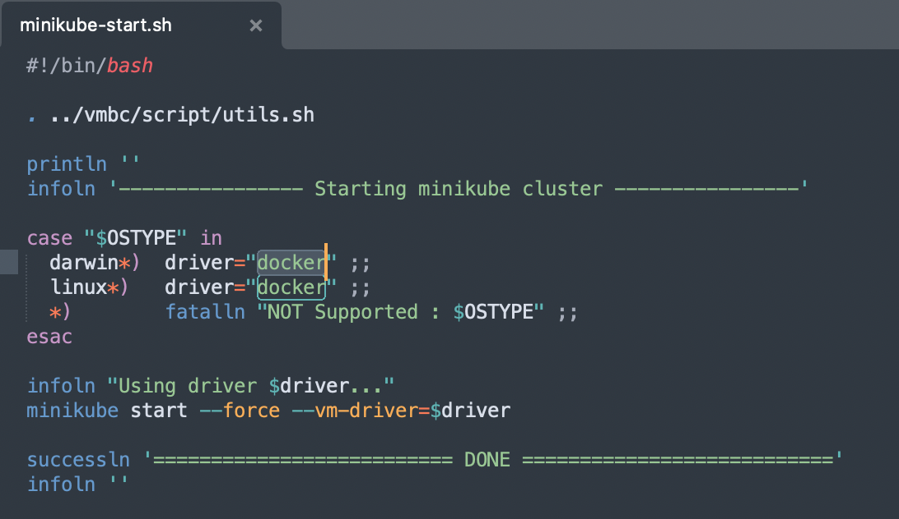
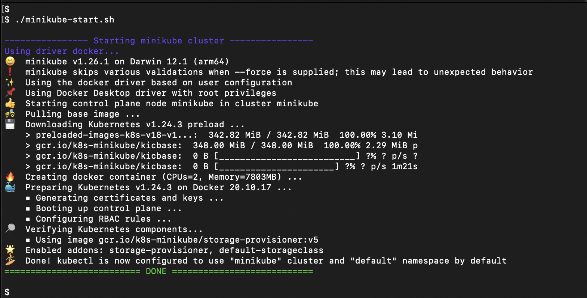
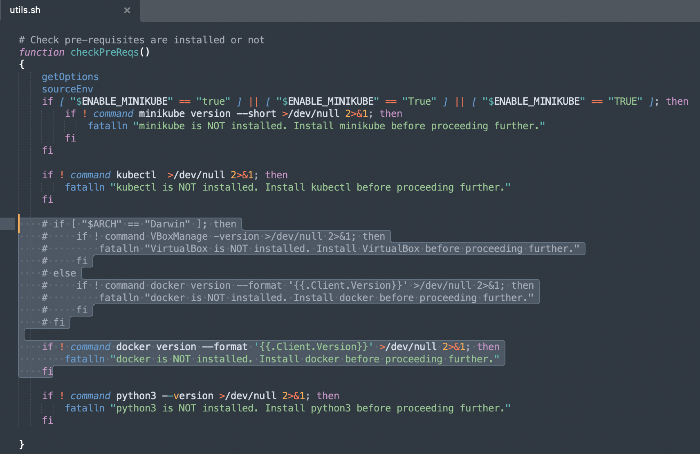
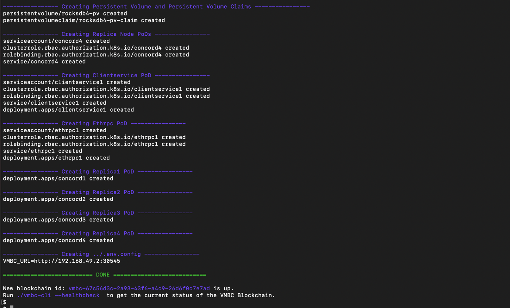
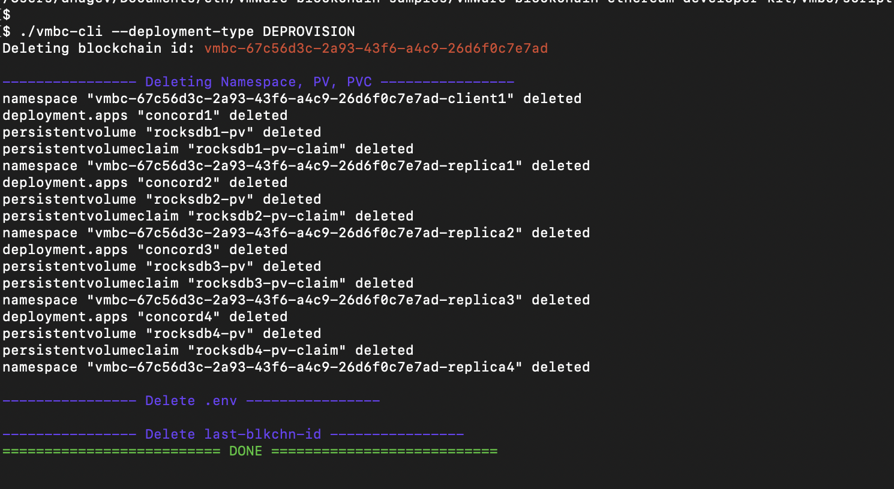
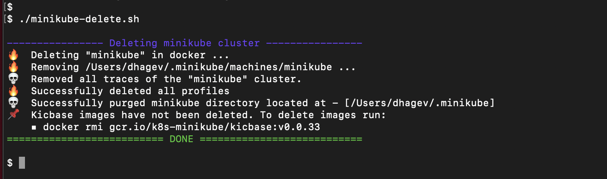

**VMware Blockchain Ethereum Developer Kit**

**Setup Development Environment on MacOS(Apple Silicon) using
Kubernetes- minikube**

**Pre-requisites - System Software for macOS**

1.  Install Docker Desktop
    <https://docs.docker.com/desktop/install/mac-install/>

> {width="6.268055555555556in"
> height="2.94375in"}\
> {width="6.268055555555556in"
> height="4.6409722222222225in"}

2.  Minikube - 1.25.1 or more <https://minikube.sigs.k8s.io/docs/start/>

> **Install minikube**

\$ brew install minikube

{width="6.268055555555556in"
height="2.3229166666666665in"}

3.  Install Python modules

> \$ cd
> vmware-blockchain-samples/vmware-blockchain-ethereum-developer-kit
>
> \$ pip3 install -r vmbc/config/requirements.txt
>
> {width="6.268055555555556in"
> height="1.6229166666666666in"}
>
> {width="6.268055555555556in"
> height="4.627083333333333in"}

4.  Starting Minikube

\$ cd
vmware-blockchain-samples/vmware-blockchain-ethereum-developer-kit/minikube

> Set the driver in minikube-start.sh to "docker"
>
> {width="6.268055555555556in"
> height="3.6277777777777778in"}

\$ ./minikube-start.sh

\$ minikube status

{width="6.268055555555556in"
height="3.1777777777777776in"}{width="6.268055555555556in"
height="1.8243055555555556in"}

**Deployment**

1.  VMware Blockchain Change directory

\$ cd
vmware-blockchain-samples/vmware-blockchain-ethereum-developer-kit/vmbc/script

2.  Change 'utils.sh' to avoid checking for 'DARWIN' type architecture

> {width="6.268055555555556in"
> height="4.063888888888889in"}

3.  VMware Blockchain Set the username and password

\$ ./vmbc-cli \--set-username-password \--username username \--password
password

4.  VMware Blockchain Deployment

> \$ ./vmbc-cli \--deployment-type PROVISION
>
> {width="6.268055555555556in"
> height="0.9729166666666667in"}
>
> {width="6.268055555555556in"
> height="3.797222222222222in"}

5.  VMware Blockchain Healthcheck

> \$ ./vmbc-cli --healthcheck
>
> {width="6.268055555555556in"
> height="0.9388888888888889in"}{width="6.268055555555556in"
> height="3.2305555555555556in"}

6.  VMware Blockchain Deployment Cleanup

> \$ cd
> vmware-blockchain-samples/vmware-blockchain-ethereum-developer-kit/vmbc/script
>
> \$ ./vmbc-cli \--deployment-type DEPROVISION
>
> {width="6.268055555555556in"
> height="3.432638888888889in"}

7.  Minikube Cleanup

> \$ cd
> vmware-blockchain-samples/vmware-blockchain-ethereum-developer-kit/minikube
>
> \$ ./minikube-delete.sh

{width="5.676750874890638in"
height="1.8583333333333334in"}

Note: Other VM drivers like [VirtualBox](https://www.virtualbox.org/),
[hyperkit](https://github.com/kubernetes/minikube/issues/11885), [VMware
Fusion](https://discussions.apple.com/thread/253530590) are currently
not officially supported for apple silicon
