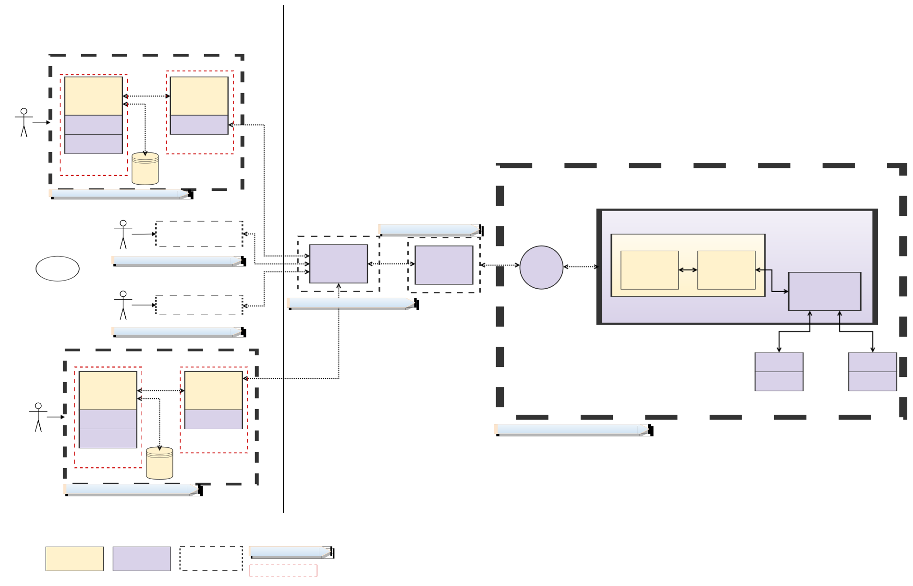

# Introduction
The base VMBC would be deployed on a kubernetes cluster leveraging helm charts.
The privacy application will be deployed along side with the VMBC deployment leveraging the ETHRPC service provided. 

The following sections brief on the deployment process and associated workflow to try out privacy capabilities. 

# TODO List:
- [ ] Fix links for reference VMBC Readme
- [ ] Fix links for values.yaml based on final location
- [ ] Fix release version

# Kubernetes deployment overview


## Prerequisite
The privacy app requires write and read permission features to get disabled!

## How to deploy privacy application
Deployment leverages the helm charts provided with the development kit for privacy application.

### Determine the required settings for helm chart installation

The following settings are required for deployment. Refer to **"values.yaml"** (@TODO - add link) file under helm chart path. Several settings are assigned to predetermined default values and users would only require to set few mandatory settings.

| Mandatory Settings      | Remarks       |  Sample  |
| ------------- | ------------- | ------------- |
| blockchainUrl | URL for ETH-RPC service. Determined from the VMBC deployments exposed service. | `blockchainUrl="http://192.168.59.102:32223"`  |

The ethRPC service port and their liveness could be determined as following:
```sh
demo>kubectl get pods
NAME                                                     READY   STATUS    RESTARTS   AGE
vmbc-deployment-client-0-clientservice-8c4c88c45-5rqmj   1/1     Running   0          95s
vmbc-deployment-client-0-ethrpc-8d9b6c67-99sgs           1/1     Running   0          95s
vmbc-deployment-replica-0-concord-64f6f8fd66-tllf9       1/1     Running   0          95s
vmbc-deployment-replica-1-concord-654d8f998d-65d8w       1/1     Running   0          95s
vmbc-deployment-replica-2-concord-6bdd5bcc74-nw47d       1/1     Running   0          95s
vmbc-deployment-replica-3-concord-6994dd8677-mg6gg       1/1     Running   0          95s

demo>minikube service list
|-------------|-----------------|--------------|-----------------------------|
|  NAMESPACE  |      NAME       | TARGET PORT  |             URL             |
|-------------|-----------------|--------------|-----------------------------|
|....|.....|....|....|
| default     | client-0-ethrpc | 8545/8545    | http://192.168.59.102:32223 |
|....|.....|....|....|
demo> nc -v 192.168.59.102 32223
Connection to 192.168.59.102 32223 port [tcp/*] succeeded!
 
Verify a ETHRPC API:
curl -X POST --data '{"jsonrpc":"2.0","method":"eth_gasPrice","id":1}' --header "Content-Type: application/json" http://192.168.59.102:32223
{"id":1,"jsonrpc":"2.0","method":"eth_gasPrice","result":"0x0"}
```

Image settings:
The registry settings are similar to VMBC deployment.
Setup required paths for the image register, repository, tags, credentials etc., 

Eg.,
```sh
--set global.image.tag="0.0.0.0.7849" 
```

Container resource settings:
There are default settings tuned for current consumption. You can scale up values if required.

Resource names (Refer to values.yaml): 
```sh
walletapp, walletcli, admin, admincli.
```
All resources comprise of settings for CPU and Memory based on units as defined by kubernetes.
Eg.,
```sh
    cpuLimit: 800m
    cpuRequest: 700m
    memoryLimit: 500Mi
    memoryRequest: 400Mi

 --set resources.walletapp.cpuLimit=900m --set resources.walletapp.memoryLimit=550Mi
 ```

### helm chart installation
```sh
helm install --set global.image.tag="0.0.0.0.7849" --set blockchainUrl="http://192.168.59.102:32223"  vmbc-privacy-app-deployment .
NAME: vmbc-privacy-app-deployment
LAST DEPLOYED: ....
NAMESPACE: default
STATUS: deployed
REVISION: 1
TEST SUITE: None
 
kubectl get pods
NAME                                                     READY   STATUS    RESTARTS   AGE
vmbc-deployment-client-0-clientservice-8c4c88c45-gsdzt   1/1     Running   0          7m19s
vmbc-deployment-client-0-ethrpc-8d9b6c67-bw8h6           1/1     Running   0          7m19s
vmbc-deployment-privacy-admin-7fd48bdc8f-zhcwz           2/2     Running   0          73s
vmbc-deployment-privacy-wallet-0                         2/2     Running   0          73s
vmbc-deployment-privacy-wallet-1                         2/2     Running   0          68s
vmbc-deployment-privacy-wallet-2                         2/2     Running   0          62s
vmbc-deployment-replica-0-concord-64f6f8fd66-l8hdf       1/1     Running   0          7m19s
vmbc-deployment-replica-1-concord-654d8f998d-wmtqr       1/1     Running   0          7m19s
vmbc-deployment-replica-2-concord-6bdd5bcc74-blc52       1/1     Running   0          7m19s
vmbc-deployment-replica-3-concord-6994dd8677-rdqct       1/1     Running   0          7m19s
 
helm list
NAME                        	NAMESPACE	REVISION	UPDATED                                	STATUS  	CHART                                   	APP VERSION
vmbc-privacy-app-deployment 	default  	1       	***UTC	deployed	vmbc-privacy-wallet-app-deployment-0.1.0	1.16.0
vmbc-privacy-test-deployment	default  	1       	***UTC	deployed	vmbc-0.1.0                              	1.16.0
```

To [enumerate container image version](https://codefresh.io/blog/three-ways-identify-images-running-kubernetes-cluster-2/) running on the pods
```sh
kubectl get pods --all-namespaces -o jsonpath="{..image}" |\
tr -s '[[:space:]]' '\n' |\
sort |\
uniq -c
    2 blockchain-docker-internal.artifactory.eng.vmware.com/vmwblockchain/clientservice:0.0.0.0.7849
      8 blockchain-docker-internal.artifactory.eng.vmware.com/vmwblockchain/concord-core:0.0.0.0.7849
      2 blockchain-docker-internal.artifactory.eng.vmware.com/vmwblockchain/ethrpc:0.0.0.0.7849
      2 blockchain-docker-internal.artifactory.eng.vmware.com/vmwblockchain/privacy-admin-app:0.0.0.0.7849
      2 blockchain-docker-internal.artifactory.eng.vmware.com/vmwblockchain/privacy-admin-cli:0.0.0.0.7849
      6 blockchain-docker-internal.artifactory.eng.vmware.com/vmwblockchain/privacy-wallet-app:0.0.0.0.7849
      6 blockchain-docker-internal.artifactory.eng.vmware.com/vmwblockchain/privacy-wallet-cli:0.0.0.0.7849
```

## Privacy application demonstration
The following operations are demonstrated by the privacy application:

Client Administrator application:
- Deploys the privacy application
- Creates privacy budgets for users

Client Wallet application:
- Configures and registers the user wallet.
- Converts public funds to private funds for anonymous transfer.
- Performs private anonymous transaction to another registered user.
- Performs public transaction to another registered user.
- Converts private funds to public funds.

The demonstration client wallet applications have canned private keys and initial public balances. 

### Administrator workflow
Administrator application CLI samples to deploy the privacy application and create privacy budgets for all users:

```sh
kubectl attach vmbc-deployment-privacy-admin-7fd48bdc8f-zhcwz -c privacy-admin-cli -i -t

If you don't see a command prompt, try pressing enter.
You must first deploy the privacy application. Use the 'deploy' command.
Enter command (type 'h' for commands 'Ctr-D' to quit):
 > h
Commands:
deploy -- generates a privacy config and deploys the privacy and token contracts.
create-budget <user-id> <amount> -- requests creation of a privacy budget for a user.

> deploy
Deploying a new privacy application...

Successfully deployed privacy application
---------------------------------------------------
Privacy contract: 0x44f95010BA6441E9C50c4f790542A44A2CDC1281
Token contract: 0x3d8b57c2D58BB8c8E36626B05fF03381734EAD43

You are now ready to configure wallets.

 > create-budget user-1 1000
Budget request for user: user-1 value: 1000 was sent to the privacy app
response: ok

 > create-budget user-2 1000
Budget request for user: user-2 value: 1000 was sent to the privacy app
response: ok

 > create-budget user-3 1000
Budget request for user: user-3 value: 1000 was sent to the privacy app
response: ok
```

### Wallet application CLI workflow samples:
- Wallet converts privacy funds from public funds. These private tokens are then leveraged for anonymous transfers.
- Transfers private funds anonymously between users
- Transfers public funds transparently between users
- Converts privacy funds back to public funds

#### User-1 <==> User-2 Samples:
The samples demonstrates transfers and other works flow between user-1/user-2 wallets. Attaching to wallet CLI, configuring and registering are similar for all users.

- Attaches to wallet user-1 CLI
```sh
 kubectl attach vmbc-deployment-privacy-wallet-0 -c privacy-wallet-cli -i -t
If you don't see a command prompt, try pressing enter.

You must first configure the wallet. Use the 'config' command.

Enter command (type 'h' for commands 'Ctr-D' to quit):
 > h
Commands:
config                    -- configures wallets with the privacy application.
show                      -- prints information about the user managed by this wallet.
register <user-id>        -- requests user registration required for spending coins.
convertPublicToPrivate <amount>             -- converts the specified amount of public funds to private funds.
transfer <amount> <to-user-id> -- transfers the specified amount between users.
public-transfer <amount> <to-user-id> -- transfers the specified amount of public funds between users.
convertPrivateToPublic <amount>             -- converts the specified amount of private funds to public funds.
```
- Configures the wallet and registers the users with privacy application.

```sh
 > config

Successfully configured privacy application
---------------------------------------------------
Privacy contract: 0x44f95010BA6441E9C50c4f790542A44A2CDC1281
Token contract: 0x3d8b57c2D58BB8c8E36626B05fF03381734EAD43

 > register
Successfully registered user.

Synchronizing state...
Ok. (Last known tx number: 0)
--------- user-1 ---------
Public balance: 10000
Private balance: 0
Privacy budget: 1000
Last executed tx number: 0
```
- Creates 250 private funds from public funds.
```sh
> convertPublicToPrivate 250
Successfully sent mint tx. Last added tx number:1
Synchronizing state...
Ok. (Last known tx number: 1)

Synchronizing state...
Ok. (Last known tx number: 1)
--------- user-1 ---------
Public balance: 9750
Private balance: 250 ===> converted private funds
Privacy budget: 1000
Last executed tx number: 1
```

- Transfers private funds to user-2. 

```sh
> transfer 50 user-2
Processing an anonymous transfer of 50 to user-2...
Successfully sent transfer tx. Last added tx number:2
Synchronizing state...
Ok. (Last known tx number: 2)
Anonymous transfer done.

Synchronizing state...
Ok. (Last known tx number: 2)
--------- user-1 ---------
Public balance: 9750
Private balance: 200
Privacy budget: 950
Last executed tx number: 2
```
- Meanwhile user-2 does private fund conversion and notices new transfer of 50 tokens. user-2 then transfers 100 private tokens to user-1.
```sh
== user-2 ==
> convertPublicToPrivate 100
Successfully sent mint tx. Last added tx number:3
Synchronizing state...
Ok. (Last known tx number: 3)

Synchronizing state...
Ok. (Last known tx number: 3)
--------- user-2 ---------
Public balance: 9900
Private balance: 150 ====> Received 50 private tokens!
Privacy budget: 1000
Last executed tx number: 3

  > transfer 100 user-1
Processing an anonymous transfer of 100 to user-1...
Successfully sent transfer tx. Last added tx number:4
Synchronizing state...
Ok. (Last known tx number: 4)
Anonymous transfer done.

Synchronizing state...
Ok. (Last known tx number: 4)
--------- user-2 ---------
Public balance: 9900
Private balance: 50
Privacy budget: 900
Last executed tx number: 4
```
- User-1 then issues 77 public token transfer to user-2
```sh
> show
Synchronizing state...
Ok. (Last known tx number: 4)
--------- user-1 ---------
Public balance: 9750
Private balance: 300  ====> Received 100 private tokens!
Privacy budget: 950
Last executed tx number: 4

> public-transfer 77 user-2
Processing public transfer of 77 to user-2...
Synchronizing state...
Ok. (Last known tx number: 4)
--------- user-1 ---------
Public balance: 9673 ===> debit of 77 tokens
Private balance: 300
Privacy budget: 950
Last executed tx number: 4
```

- User-2 receives 77 public tokens from user-1
```sh
> show
Synchronizing state...
Ok. (Last known tx number: 4)
--------- user-2 ---------
Public balance: 9977 ==> credit of 77 public token
Private balance: 50
Privacy budget: 900
Last executed tx number: 4
```
- user-1 converts back private funds to public funds.
```sh
> convertPrivateToPublic 300
Processing a burn operation for 300...
Successfully sent self-transfer tx as part of burn. Last added tx number:5
Synchronizing state...
Ok. (Last known tx number: 5)
Successfully sent burn tx. Last added tx number:6
Synchronizing state...
Ok. (Last known tx number: 6)
Burn operation done.

Synchronizing state...
Ok. (Last known tx number: 6)
--------- user-1 ---------
Public balance: 9973
Private balance: 0 =====> All private tokens converted to public
Privacy budget: 950
Last executed tx number: 6
```